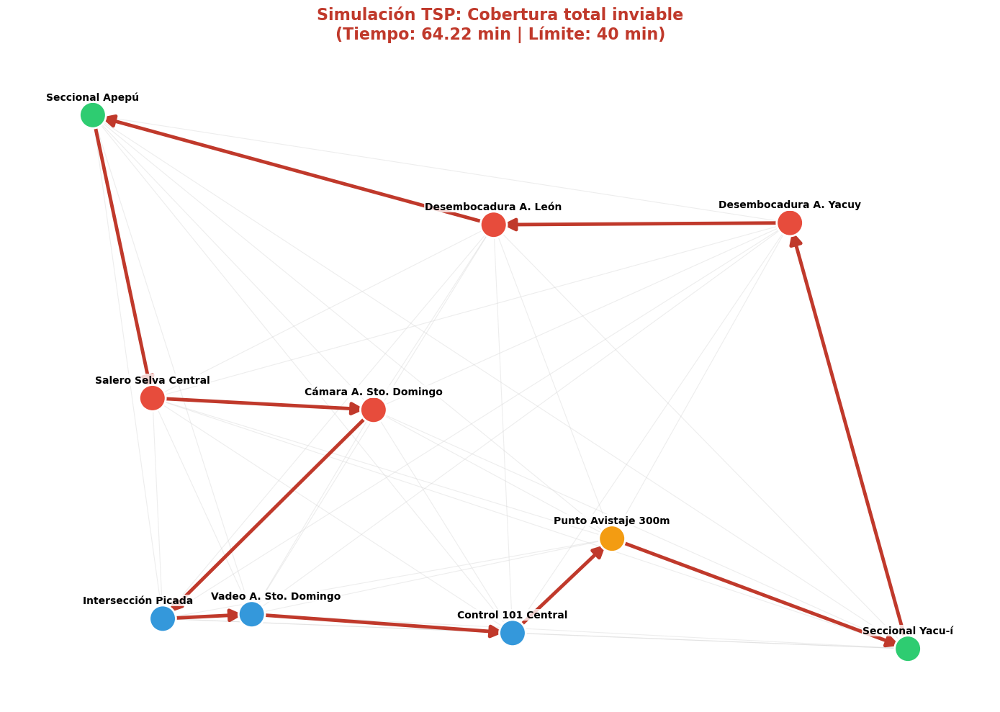

# Optimización de patrullaje autónomo con drones (Etapa 1)

**¿Cómo vigilar la selva eficientemente cuando la batería es el límite?**

Este proyecto aplica técnicas de **Investigación Operativa** y **Teoría de Grafos** para diseñar rutas de vuelo autónomas en el Parque Nacional Iguazú. Utilizando Programación Lineal Entera (MIP), el sistema transforma un problema logísticamente inviable (cobertura total) en una misión estratégica que maximiza la vigilancia de puntos críticos bajo restricciones estrictas de batería.

> 🇺🇸 [English Version](./README.md)


*Visualización de la ruta óptima resolviendo el 'Orienteering Problem'. El algoritmo prioriza 'Hotspots' (rojo) y descarta nodos de bajo valor (gris) para cumplir con la autonomía de 40 minutos.*

## Contexto y problemática: La lucha contra la caza furtiva
El Parque Nacional Iguazú enfrenta constantes amenazas de caza furtiva. Los cazadores utilizan puntos estratégicos conocidos como **saleros** (afloramientos minerales donde los animales acuden a lamer el suelo) y **picadas** (senderos rudimentarios abiertos en la selva) para sus actividades ilegales. 

Vigilar estas zonas mediante patrullaje humano es peligroso, lento y logísticamente costoso. La implementación de drones permitiría una respuesta rápida, pero presenta un desafío de ingeniería; un dron que se queda sin batería sobre el dosel arbóreo es una unidad perdida.

### El área de estudio: Sector Apepú
Para este proyecto, delimitamos un área crítica de 25 km² en el Sector Apepú. Este sector fue elegido por su alta densidad de biodiversidad y la presencia de infraestructura preexistente (seccionales de guardaparques). 

### Construcción del grafo: Datos reales vs. artificiales
Uno de los mayores desafíos técnicos fue la **curaduría de datos espaciales**, ya que no existe un dataset público de "puntos de interés de caza". La red de 10 nodos se construyó mediante:
* **Nodos reales:**  Seccionales de vigilancia y "saleros" conocidos, obtenidas cruzando información de reportes de guardaparques con cartografía oficial.
* **Nodos de tránsito (artificiales):** Puntos calculados para asegurar la conectividad del dron y optimizar las trayectorias entre los objetivos reales, coordenadas de cámaras trampa.

> 💡 *En el **Notebook 01** se detalla el proceso de georreferenciación y la lógica de puntuación (Score) asignada a cada tipo de nodo.*

---

## Flujo de trabajo y resultados
El proyecto se estructura en dos fases analíticas que simulan la evolución en la toma de decisiones:

### Fase 1: Diagnóstico de factibilidad (El fracaso del TSP)
*Enfoque: Geodesia y grafos (Notebook `01_Analisis_Factibilidad_TSP`)*

Inicialmente, evaluamos la estrategia intuitiva de cubrir todo (Traveling Salesperson Problem). Al modelar el terreno y calcular distancias reales (Haversine), demostramos que esta estrategia es físicamente imposible: requiere 64 minutos de vuelo, superando la autonomía del dron (40 min) en un 60%.

<div align="center">
  
  <p><i>La ruta roja (TSP) colapsa por falta de batería antes de volver a la base.</i></p>
</div>

### Fase 2: El duelo de algoritmos (Greedy vs. MIP)
*Enfoque: Programación matemática (Notebook 2)*

Ante la inviabilidad física, implementamos dos estrategias para resolver el **Orienteering Problem (OP)**:

1.  **Heurística Greedy:** Simula una decisión humana rápida, yendo siempre al punto más valioso y cercano.
2.  **Optimización exacta (MIP con SCIP):** Busca la solución matemática perfecta evaluando todas las combinaciones posibles.


| Métrica | Estrategia TSP (Fuerza bruta) | Heurística Greedy (Intuición) | Optimización MIP (Matemática) |
| :--- | :--- | :--- | :--- |
| **Objetivo** | Visitar todo | Mejor ratio local | **Máximo score global** |
| **Tiempo de vuelo** | 64.2 min (Inviable) | 38.62 min (Operativo) | **36.99 min (Eficiente)** |
| **Score de vigilancia** | 100% (Teórico) | Máximo | **Máximo** |
| **Resultado** | Pérdida de dron | Misión exitosa | **Misión óptima** |


> 💡 **Hallazgo técnico:**
Aunque el solver MIP fue más rápido, es importante notar que su función objetivo actual es exclusivamente maximizar el score. En este escenario, la ruta de máximo puntaje resultó ser también muy eficiente en tiempo. Sin embargo, en problemas más complejos, el solver podría haber elegido cualquier ruta que no superara los 40 minutos sin importar el ahorro de batería. Esta "indiferencia al tiempo" es un riesgo latente que justifica la necesidad de una optimización multiobjetivo en la siguiente etapa.
---
## Desafíos técnicos y soluciones
* **Curaduría de datos geoespaciales:** Realicé un proceso de limpieza y cruce de datos entre mapas geográficos oficiales y registros de patrullaje para extraer coordenadas precisas en un entorno donde no existen direcciones postales ni cartografía comercial detallada.
* **Modelado de restricciones:** Implementé un modelo MIP con `PySCIPOpt`, definiendo variables binarias ($x_{ij}$) para el flujo de ruta.
* **Eliminación de subtours:** Uno de los mayores retos fue evitar que el dron creara "anillos aislados" en el grafo. Lo solucioné implementando las restricciones matemáticas de **Miller-Tucker-Zemlin (MTZ)**.
* **Visualización operativa:** Transformé la salida abstracta del solver en un mapa interactivo con `Folium` y `AntPath`, permitiendo visualizar el flujo de la patrulla sobre el terreno real.

## Impacto y conclusiones de la Etapa 1
El modelo logró generar un plan de vuelo operativo que valida el uso de drones en el sector. Las conclusiones principales son:

* **De lo imposible a lo táctico:** Transformamos una misión fallida (TSP) en una operación viable seleccionando inteligentemente los objetivos.
* **Superioridad del análisis global:** El solver MIP ahorró casi 1.6 minutos de batería adicionales frente al Greedy al encontrar una secuencia de visita más fluida
* **Seguridad operativa:** Se garantiza matemáticamente el retorno a la base (Seccional Apepú), eliminando el riesgo de aterrizajes forzosos en la selva.
* **Validación de algoritmos:** Comprobamos que para grafos pequeños (10 nodos), una heurística bien diseñada puede competir con solvers complejos, aunque el MIP es necesario para garantizar optimidad en escalas mayores.

Este repositorio está diseñado para ser leído de forma secuencial. Los notebooks contienen una narrativa técnica extendida, justificaciones matemáticas y el código fuente documentado paso a paso.

## Cómo ejecutar este proyecto localmente

### 1. Requisitos previos
Este proyecto utiliza `PySCIPOpt`, que requiere la instalación del solver **SCIP** (se recomienda usar Conda).

### 2. Instalación y ejecución

1. **Clonar el repositorio:**
   ```bash
   git clone [https://github.com/FernandaVil/drone-patrol-optimization.git](https://github.com/FernandaVil/drone-patrol-optimization.git)
2. **Crear entorno e instalar dependencias:**
    ```bash
      cd drone-patrol-optimization
      conda create -n drones python=3.9
      conda activate drones
      conda install -c conda-forge pyscipopt  # Solver SCIP 
      pip install -r requirements.txt
3. **Ejecución:** Abrir los notebooks en orden.
  * notebooks/01_Analisis_Factibilidad_TSP.ipynb : Diagnóstico geoespacial.

  * notebooks/02_Optimizacion_Mision_OP.ipynb : Comparativa Greedy vs MIP y mapa final.

## Estructura del proyecto
  ```bash
      drone-patrol-optimization/
      ├── notebooks/
      │   ├── 01_Analisis_Factibilidad_TSP.ipynb
      │   └── 02_Optimizacion_Mision_OP.ipynb
      ├── output/
      │   └── mision_iguazu_final.html  <-- Mapa interactivo
      ├── requirements.txt
      └── README.md
   ```
## Próximos pasos: Etapa 2 - Complejidad dinámica
Esta primera etapa resolvió la planificación estática (Offline). La siguiente fase del proyecto, actualmente en diseño, abordará la realidad cambiante de la selva:

* Nodos dinámicos (Event-Driven): ¿Qué pasa si una cámara trampa detecta movimiento en medio del vuelo? El sistema deberá recalcular la ruta óptima en tiempo real basándose en alertas de sensores.

* Riesgo de terreno (Rij​): No es lo mismo volar sobre un sendero que sobre selva virgen. Incorporaremos una matriz de costos de riesgo para penalizar trayectorias donde la recuperación del equipo sería imposible.

* Función multiobjetivo: Refinaremos el algoritmo MIP para que no solo maximice el puntaje, sino que minimice el tiempo de vuelo como objetivo secundario, para garantizar matemáticamente siempre la ruta más rápida ante múltiples opciones de igual puntaje (evitando soluciones sub-óptimas en escenarios más complejos).
## Referencias y fuentes de consulta
Para asegurar la validez técnica del modelo de optimización y la precisión de los cálculos geoespaciales, se consultaron las siguientes fuentes:

* **Orienteering problem:**  Gunawan, A., Lau, H. C., & Vansteenwegen, P. (2016). *Orienteering Problem: A survey of recent variants, solution approaches and applications*. European Journal of Operational Research. [DOI: 10.1016/j.ejor.2016.04.059](https://doi.org/10.1016/j.ejor.2016.04.059)
* **Restricciones de eliminación de subtours (MTZ):** * Miller, C. E., Tucker, A. W., & Zemlin, R. A. (1960). *Integer Programming Formulation of Traveling Salesman Problems*. Journal of the ACM (JACM). (Fundamento matemático para las restricciones de secuencia utilizadas en este proyecto).
* **Cálculo de distancias sobre la esfera (Haversine):** * Sinnott, R. W. (1984). *Virtues of the Haversine*. Sky and Telescope. (Base matemática para la medición de distancias geodésicas en el Sector Apepú).
* **Cartografía y contexto regional:**
    * Datos obtenidos mediante el cruce de información del **Instituto Geográfico Nacional (IGN Argentina)** y reportes de patrullaje del Parque Nacional Iguazú.
---
*Proyecto desarrollado como exploración personal en Investigación Operativa y Sistemas de Soporte a la Decisión (DSS).*
